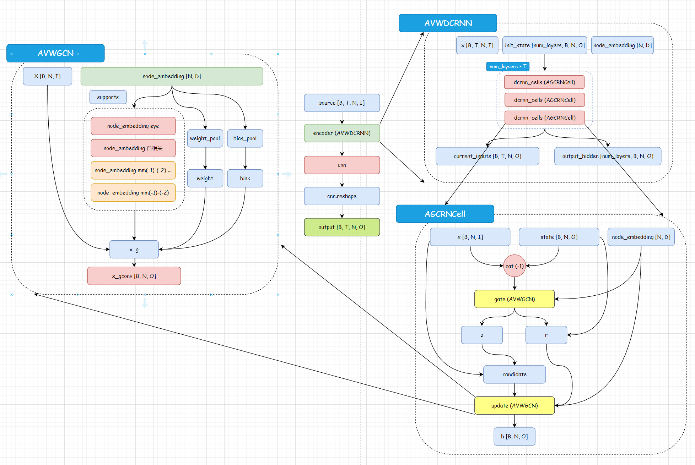

# Adaptive Graph Convolutional Recurrent Network for Traffic Forecasting

This folder concludes the code and data of our AGCRN model: [Adaptive Graph Convolutional Recurrent Network for Traffic Forecasting](https://arxiv.org/pdf/2007.02842.pdf), which has been accepted to NeurIPS 2020. 

## Structure:

* data: including PEMSD4 and PEMSD8 dataset used in our experiments, which are released by and available at  [ASTGCN](https://github.com/Davidham3/ASTGCN/tree/master/data).

* lib: contains self-defined modules for our work, such as data loading, data pre-process, normalization, and evaluate metrics.

* model: implementation of our AGCRN model

## Run

- 在`model.ipynb`文件中有对`AGCRN`模型的详细注释，以及每个模块单独运行的测试代码。

- 在`data`目录下存放有数据集文件，数据格式为`npz`格式，可以直接使用`np.load`加载。

- 进入`model`目录，直接运行`python Run.py --mode train`即可开始训练模型。

以下是代码结构图：

## Requirements

Python 3.6.5, Pytorch 1.1.0, Numpy 1.16.3, argparse and configparser

To replicate the results in PEMSD4 and PEMSD8 datasets, you can run the the codes in the "model" folder directly. If you want to use the model for your own datasets, please load your dataset by revising "load_dataset" in the "lib" folder and remember tuning the learning rate (gradient norm can be used to facilitate the training).

Please cite our work if you find useful.

